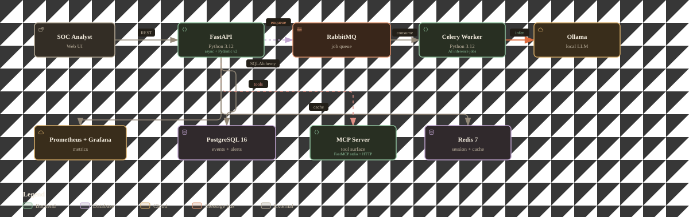
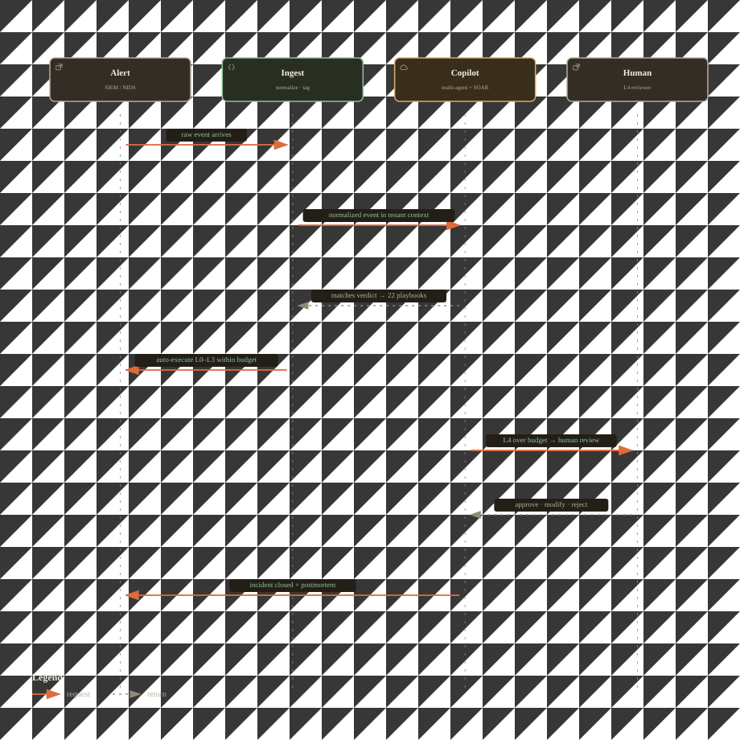
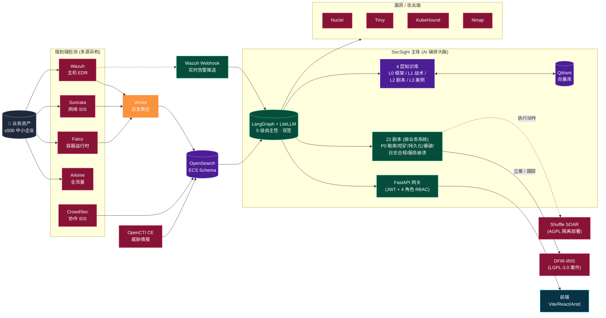

# SecSight — AI 驱动的安全运维平台

> AI 辅助的 SecOps Copilot + 自动处置 SOAR 引擎。
> 监控业务系统 → AI 研判 → 半自动应急响应 → 知识沉淀。

[](https://github.com/echocc00/SecSight/releases/latest)
[](./LICENSE)
[](https://github.com/echocc00/SecSight/actions/workflows/license-check.yml)

> 💼 **商业授权 / Commercial licensing**
>
> 本项目以开源协议发布(详见 [LICENSE](./LICENSE)),你可自由用于个人/企业内部项目。
> 若你希望用于**对外商业产品 / SaaS / 销售**并需要:
> - 作者署名可移除 / 不想被认出来源
> - 闭源分发 / 不公开修改
> - 长期维护支持 / 私有定制
> - 法律意见 / 合规背书
>
> 请通过以下方式联系作者协商**独立商业授权**:
> - GitHub: [@echocc00](https://github.com/echocc00)
> - 项目主页 Issues / Discussions(按项目)
>
> 大部分项目 24 小时内响应,首次咨询免费。
>
> *(本说明不构成法律意见,具体权利义务以 [LICENSE](./LICENSE) 文本为准。)*

---


## 核心定位

面向中小型企业(≤500 资产)的 AI 安全运维平台,通过集成成熟开源组件 + 自研 AI 编排大脑,把传统 SOC 的"采集→告警→人工分析→处置"压缩为"采集→AI研判→半自动响应"。

**关键决策**: 不重新发明轮子——检测/SIEM/SOAR/漏洞扫描全部用成熟开源项目,SecSight 自身只做 AI 研判编排 + 场景化剧本 + 统一事件总线。

## 技术栈

| 层 | 选型 |
|---|---|
| 主机 EDR | Wazuh + Sysmon-Modular + Falco |
| 网络检测 | Suricata + Arkime + Coraza + CrowdSec |
| SIEM/日志 | OpenSearch + Vector (ECS schema) |
| 威胁情报 | OpenCTI CE + 免费源(付费接口预留) |
| SOAR 执行 | Shuffle (AGPL 隔离部署) |
| 漏洞/攻击面 | Nuclei + Trivy + KubeHound + Nmap |
| AI 核心 | LangGraph + LiteLLM 网关 + 云端 LLM(DeepSeek/MiniMax) + Qdrant |
| 案件管理 | DFIR-IRIS (LGPL-3.0) |
| 工具协议 | HTTP/REST 直调 (License 隔离通过网络边界) |
| 后端/前端 | FastAPI + Vite/React/Antd |

## 核心特性

- **22 个真实企业剧本**(按业务系统分组),Phase1 优先 6 个 P0(勒索/挖矿/持久化/暴破/日志合规/服务崩溃)
- **5 级自主性**(L1-L5),每动作标注 autonomy_level,高危处置 L2 强制双签
- **4 层知识库**(L0 框架/L1 战术/L2 剧本/L3 案例),运行时沉淀形成飞轮
- **私有化优先**,AGPL/GPL 组件进程隔离,主体可闭源商业化
- **国产化适配**,境内 LLM + 等保 2.0 合规

## 架构

<p align="center">
  
</p>


<p align="center">
  
</p>




## 文档

| 文档 | 说明 |
|---|---|
| [docs/ARCHITECTURE.md](docs/ARCHITECTURE.md) | 整体架构(A 体系) |
| [docs/02-design.md](docs/02-design.md) | 详细设计(B 体系,概念框架来源) |
| [docs/03-selection-arbitration.md](docs/03-selection-arbitration.md) | 选型裁决记录(v1.1,收敛版) |
| [docs/04-implementation-phase1.md](docs/04-implementation-phase1.md) | Phase1 实施计划 |
| [docs/research/](docs/research/) | 7 份子领域调研报告 |

## 快速开始
> 📘 想要 **5 分钟完整跑通**?[看 `docs/getting-started.md`](docs/getting-started.md) — 涵盖 docker / 数据库初始化 / 验证清单。


```bash
# 1. 配置环境变量
cp deploy/.env.example deploy/.env
# 编辑 .env: 填入 DeepSeek/MiniMax API key、Wazuh/OpenSearch 密码等

# 2. 启动基础设施(分组建议)
cd deploy
docker compose up -d postgres qdrant litellm opensearch vector
docker compose up -d wazuh-manager wazuh-indexer wazuh-dashboard
docker compose up -d shuffle opencti dfir-iris

# 3. 启动 SecSight 主体
docker compose up -d secsight-backend secsight-frontend

# 4. 访问
- SecSight Dashboard: http://localhost:8080
- Wazuh Dashboard:    http://localhost:5601
- OpenSearch:         http://localhost:9200
- Shuffle:            http://localhost:3001
- OpenCTI:            http://localhost:8082   (隔离网段,仅后端调用)
- DFIR-IRIS:          http://localhost:8001
- Prometheus:         http://localhost:9090
- Grafana:            http://localhost:3000
```

> 详细部署见 [docs/04-implementation-phase1.md](docs/04-implementation-phase1.md)。

## License

SecSight 主体代码: Apache-2.0 (可闭源商业化)。
集成组件遵循各自 License,AGPL/GPL 组件(Shuffle/Wazuh/KubeHound)进程隔离部署,不链接代码。

## 状态

🚀 v0.6.1 — OpenCTI 真实验证通过: 642 测试,覆盖率 87%+。OpenCTI 6.2 容器 (隔离网段) 真实联调 + compose 部署修复。

**v0.6.1 新增 (OpenCTI 容器真实验证)**:
- **OpenCTI 6.2 真实联调**: 容器 healthy + /health 报 opencti: ok + live 测试 2/2 + 注入 E2E 三源情报真实查询 (AbuseIPDB/OTX/OpenCTI 并行,不 import pycti)
- **compose 部署修复**: 端口 8080→4000 (OpenCTI 6.2 API 监听 4000);admin env 改 APP__ADMIN__* 双下划线 (nconf separator='__');token 改合法 UUID;OpenSearch 自签名 TLS 放行;补 MinIO S3 凭据 (InvalidAccessKeyId 修复);healthcheck 用 node fetch (容器无 curl)
- **镜像构建修复**: requirements.lock 删 Windows 专属 pywin32 (破坏 Linux 构建);Dockerfile COPY alembic 迁移文件 (置于 editable install 后)

**v0.6.0 — 全栈加固 + 实时化 + 22 剧本达成: 642 测试,覆盖率 87%+。Alembic 迁移体系 / 7 角色 LangGraph / 审计链 / 限流 / 告警聚合 / Refresh Token / WebSocket 实时推送 / 真实 BGE-m3 Embedding / OpenCTI 归因 / **设计文档 22 个剧本全部落地**。**

**v0.6 新增 (W1-W3 加固 + 设计对齐)**:
- **迁移与一致性**: Alembic async 迁移 + 生产启动 head 校验 (deploy/migrate.sh);依赖锁定 requirements{,-dev,-pg,-embedding}.lock + CI 校验 lock 不漂移
- **Agent 织入**: DFIR/IRLead/Compliance/SOCManager 进 workflow;P0 事件高危动作强制 L2 三签;Proactive Agent APScheduler 自动调度,高危发现自动建 Case
- **告警风暴抑制**: 时间窗聚合 (规则+主机+源IP 窗口内并入现有 Case),已闭环 Case 不吸收,deduped 计数入 /metrics
- **认证升级**: JWT access 30min + refresh 7d 轮换/吊销;生产种子密码随机生成;前端 axios 自动续期 + 并发 401 单飞
- **审计链**: 审计日志 SHA256 hash 链 (seq/prev/entry),/api/audit/verify 断链定位,合规报告内嵌完整性校验;180 天保留到期自动清理 (重建保留段链)
- **限流**: login 5 / inject 30 / webhook 600 / search 60 / approval 120 每分钟,Redis 共享计数器 (多副本不放大)
- **实时推送**: WebSocket /api/ws/events —— 新告警/审批/执行步骤/案例闭环推送到 Dashboard/审批面板/Case 时间线
- **真实 Embedding**: TFIDF / BGE-m3 / OpenAI 兼容三 provider;换 provider 自动切集合 (维度隔离) + reindex 脚本
- **OpenCTI 归因**: GraphQL 搜 IoC + APT/恶意软件归因 (第 3 情报源,纯 HTTP 不 import pycti)
- **剧本 22 达成**: 补 10 剧本 (文件篡改/DDoS/WAF/Webshell/DNS隧道/数据库异常/API滥用/越权访问/备份失败/等保基线) → 设计文档 22 个场景全部覆盖
- **处置正确性**: 高危 L2 动作强制三签兜底 (YAML 漏写不静默降级);真实 Shuffle 异步执行状态轮询回写 (不再"已触发"冒充"已成功");action target 从告警解析真实资产
- **Dashboard 实时化**: 订阅 WS 即时刷新 (修复 /health 404 致 0 案件的既存 bug)
- **国产设备适配**: 8 个真实格式 fixture + 修复 srcip/dstip 无下划线、天眼 sensor、绿盟 RSAS 字段缺口
- **前端**: 独立审批面板 /approvals (跨 Case 待办+双签进度+严重性筛选)、执行时间线 (成功/失败/跳过+执行器+目标)、合规报告入口 /compliance (报告生成+审计链自检)
- **处置目标解析**: 动作 target 从告警解析真实资产 (host/ip/pid/domain),不再空对象 —— 修复审批人看不到"要隔离谁"、Shuffle 拿空 target 的核心问题

**v0.5 新增 (Wazuh + Shuffle 真实链路)**:
- Wazuh webhook 接收器 + 真实 Shuffle SOAR 执行器 (REST API,故障降级 mock)
- docker-compose 7 组件全栈 + 健康检查 + 资源限制 + 网络隔离
- CI: license 隔离 + 依赖 license 扫描 (AGPL/GPL/SSPL 阻断,放行 LGPL/MPL) + SBOM + Trivy

**LLM 接入** (mock_mode=false):
- 真 LLM 主: MiniMax (OpenAI 兼容直连),研判由真实推理生成
- 故障降级: LLM 调用/解析失败自动回退 mock,闭环不断
- 组件解耦: LLM/检索/执行各自独立开关 (SECSIGHT_MOCK_MODE / ENABLE_QDRANT / ENABLE_SHUFFLE)

**威胁情报接入** (ENABLE_THREAT_INTEL=true):
- 免费源: AbuseIPDB (IP) + OTX (全类型) + OpenCTI (本地 STIX,APT 归因)
- 多源并行 + 置信度合成;IoC 自动提取;真实 API 失败回退 mock
- enrich_ioc 节点接入 workflow,情报进 LLM prompt

**已验证剧本** (mock 端到端):
| 剧本 | MITRE | L2 审批 | 自动闭环 |
|---|---|---|---|
| 挖矿病毒 | T1496 | ✓ | — |
| 勒索病毒 | T1486 | ✓ | — |
| 持久化清除 | T1053.003 | ✓ | — |
| SSH 暴破 | T1110 | ✓ | — |
| 日志合规 | T1562 | — | ✓ (无 L2 自动执行) |
| 服务崩溃 | T1489 | ✓ | — |


---

<sub>📋 本 README 遵循 [echocc00/README-TEMPLATE.md](https://github.com/echocc00/.github/blob/main/README-TEMPLATE.md) 写作规范</sub>